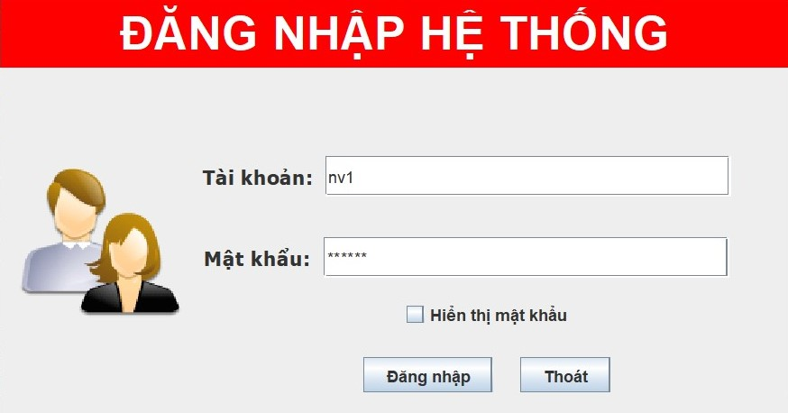
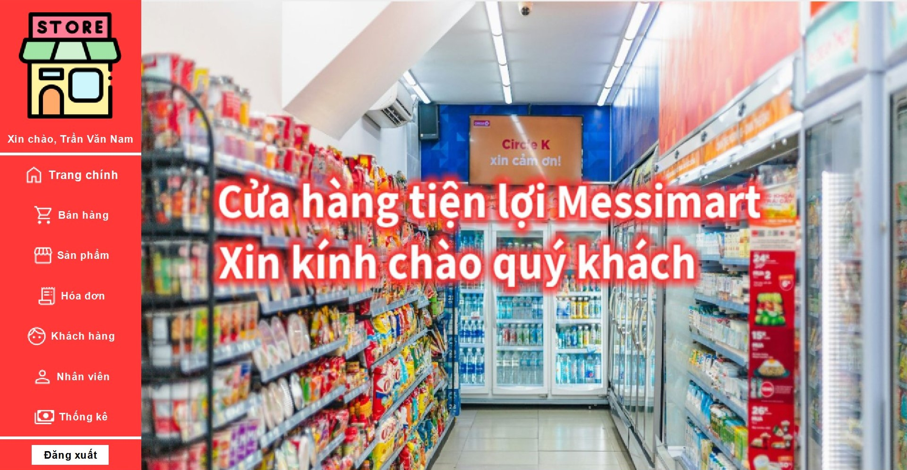
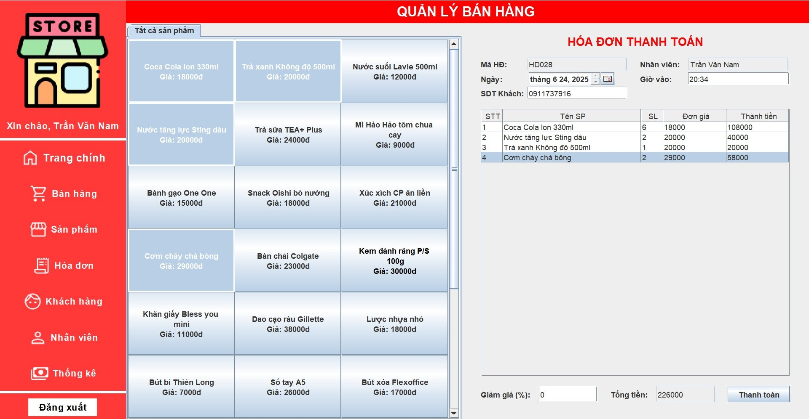
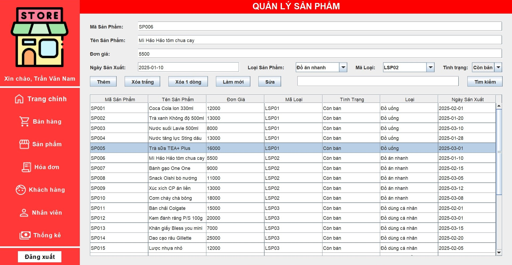
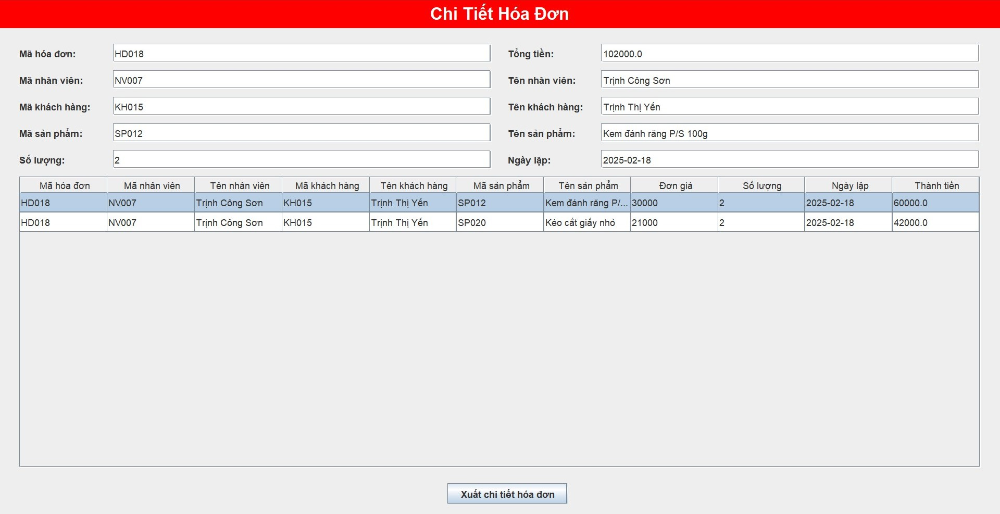
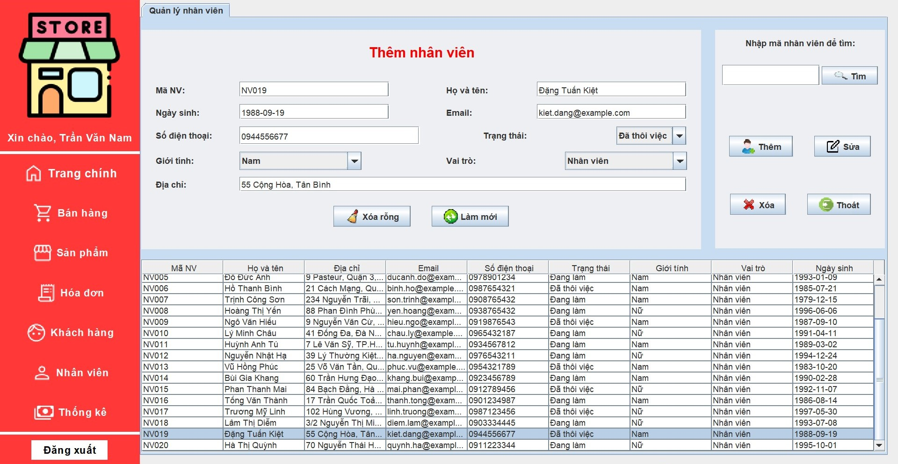
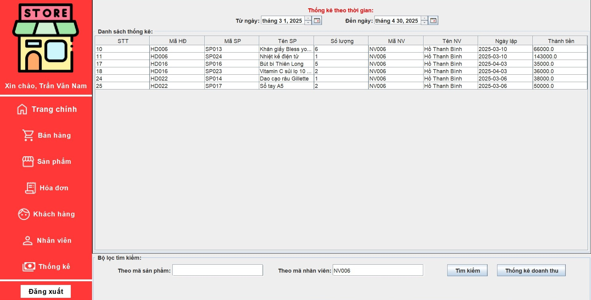

# 🛒 Retail Management System

The **Retail Management System** is a desktop application built using **Java Swing**, designed to help employees efficiently manage a convenience store. It includes secure login, a comprehensive sales system, customer and employee management, invoice management, and detailed revenue statistics. The application's user interface and interactions are in Vietnamese.

---

## ✨ Key Features

### 🔐 Login System

* Employee-only login to access the system.
* Admin accounts have additional privileges.

### 🧾 Sales & Invoice Processing

* Choose products to add to the customer's cart
* Display selected items with adjustable quantities
* Option to apply a percentage discount, the total is adjusted automatically
* Automatically generate a unique invoice ID
* Record the logged-in employee's name and the current timestamp
* Require customer phone number before invoice generation.

### 📦 Product Management

* Display a complete list of available products in the system
* Add new products to the available products list 
* Edit existing product details
* Mark products as discontinued, exclude them from sales 

### 📋 Invoice History

* View complete list of past sales invoices
* Option to view detailed information of invoice, including:

  * Purchased products and quantities
  * Responsible employee
  * Date, time, and customer info

* Option to generate a PDF of the selected invoice and all its details

### 👤 Customer Information Management

* Store and update customer information.
* View customer profiles and purchase history.

### 👥 Employee Management (**Admin-Only**)

* View, add, and edit employee information 
* Manage roles, contact details, work shifts, employment status

### 📈 Sales Statistics & Report

* Search for all invoices in selected time frame
* Optional filters:

  * Product ID
  * Employee
* Automatically display invoices that match the selected criteria.
* Generate a PDF report summarizing the filtered results, including:

  * Total revenue (within the selected period)
  * Best-selling product
  * Top-performing employee (most invoices handled)
  * List of all filtered invoices with full details

---

## 🖥️ Interface Overview

### Login Screen  


### Home Screen  


### Sales Screen  


### Product Management  


### Invoice History  


### Invoice Detail  


### Customer Management  


### Employee Management  


### Revenue Statistics  



---

## 📂 Project Structure

```plaintext
src/
├── connectDB/         # Database connection and configuration
├── dao/               # Data access logic
├── entity/            # Data model definitions
└── gui/               # UI screens and interaction handlers
```

---

## 🧪 Test Coverage

* Authentication and role-based access
* Sales and invoice workflows
* Product and inventory logic
* PDF generation functionality
* Statistical filtering and reporting
* Exception handling for invalid operations

---

## ✅ Validation & Exception Handling

* All form fields (dates, quantities, text inputs) are validated before processing.
* Only valid phone numbers and numeric quantities are accepted.
* Invoices cannot be created without selecting products and entering a phone number.
* Admin-only functions are locked for non-admin users.
* Discontinued products are hidden from sales and cannot be added to invoices.
* User-friendly error messages are displayed for invalid actions (e.g., empty fields, unauthorized access).

---

## 🛠️ Technologies Used

* **Java SE 17+**
* **Java Swing**
* **JUnit 5** 
* **Eclipse IDE**
* **Microsoft SQL Server**
* **iText PDF**

---

## 🚧 Future Enhancements

* Barcode scanner integration
* Inventory management for products
* Revenue charts and graphs
* User activity log (audit trail)
* Export invoice summary as Excel
* Multilingual support (English/Vietnamese)

---
